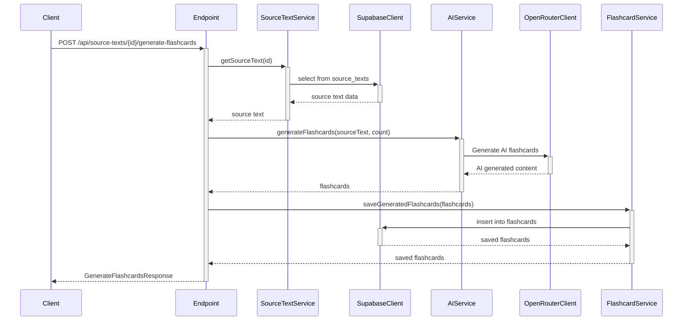

# API Endpoint Implementation Plan: Generate Flashcards from Source Text

## 1. Przegląd punktu końcowego
Endpoint służy do generowania fiszek edukacyjnych z wykorzystaniem sztucznej inteligencji na podstawie istniejącego tekstu źródłowego. Wywołanie punktu końcowego spowoduje utworzenie określonej liczby fiszek w systemie, które użytkownik będzie mógł następnie zaakceptować lub odrzucić.

## 2. Szczegóły żądania
- **Metoda HTTP**: POST
- **Struktura URL**: `/api/source-texts/{id}/generate-flashcards`
- **Parametry**:
  - **Wymagane**: `id` (UUID tekstu źródłowego w ścieżce URL)
  - **Opcjonalne**: brak
- **Request Body**:
  ```typescript
  {
    count?: number; // optional, default: 5
  }
  ```

## 3. Wykorzystywane typy
```typescript
// Input Command
import type { GenerateFlashcardsCommand } from "../../../types";

// Response Type
import type { GenerateFlashcardsResponse, FlashcardDto, ApiErrorResponse } from "../../../types";
```

## 4. Szczegóły odpowiedzi
- **Sukces** (200 OK):
  ```typescript
  {
    flashcards: FlashcardDto[]; // wygenerowane fiszki
    generation_stats: {
      requested_count: number; // liczba zamówionych fiszek
      generated_count: number; // liczba faktycznie wygenerowanych fiszek
      total_time_ms: number;   // całkowity czas generowania
    }
  }
  ```
- **Błędy**:
  - 401 Unauthorized: Użytkownik nie jest zalogowany
  - 404 Not Found: Tekst źródłowy nie istnieje lub nie należy do użytkownika
  - 422 Unprocessable Entity: Błąd podczas generowania fiszek przez AI
  - 503 Service Unavailable: Usługa AI jest niedostępna

## 5. Przepływ danych
1. Walidacja danych wejściowych (id tekstu źródłowego, opcjonalny parametr count)
2. Pobranie tekstu źródłowego z bazy danych
3. Sprawdzenie, czy tekst należy do zalogowanego użytkownika
4. Wywołanie usługi AI w celu wygenerowania fiszek
5. Zapisanie wygenerowanych fiszek w bazie danych
6. Zwrócenie wygenerowanych fiszek i statystyk generowania



## 6. Względy bezpieczeństwa
- **Uwierzytelnienie**: Endpoint wymaga, aby użytkownik był zalogowany
- **Autoryzacja**: Tylko właściciel tekstu źródłowego może generować fiszki
- **Walidacja danych**: 
  - ID tekstu źródłowego musi być poprawnym UUID
  - Parametr count musi być liczbą całkowitą większą od zera
- **Ochrona przed nadużyciem**:
  - Limitowanie liczby żądań na sekundę/minutę (rate limiting)
  - Maksymalna liczba fiszek do wygenerowania na żądanie

## 7. Obsługa błędów
- **401 Unauthorized**:
  - Użytkownik nie jest zalogowany
  ```json
  {
    "message": "Aby wykonać tę operację, musisz być zalogowany",
    "code": "UNAUTHORIZED"
  }
  ```

- **404 Not Found**:
  - Tekst źródłowy nie istnieje
  ```json
  {
    "message": "Tekst źródłowy o podanym identyfikatorze nie został znaleziony",
    "code": "SOURCE_TEXT_NOT_FOUND"
  }
  ```
  - Tekst źródłowy nie należy do zalogowanego użytkownika
  ```json
  {
    "message": "Nie masz dostępu do tego tekstu źródłowego",
    "code": "ACCESS_DENIED"
  }
  ```

- **422 Unprocessable Entity**:
  - Błąd podczas generowania fiszek przez AI
  ```json
  {
    "message": "Nie udało się wygenerować fiszek z podanego tekstu",
    "code": "AI_GENERATION_FAILED",
    "details": {
      "error": "[szczegóły błędu]"
    }
  }
  ```
  - Niepoprawny parametr count
  ```json
  {
    "message": "Parametr 'count' musi być liczbą całkowitą większą od zera",
    "code": "INVALID_COUNT_PARAMETER"
  }
  ```

- **503 Service Unavailable**:
  - Usługa AI jest niedostępna
  ```json
  {
    "message": "Usługa generowania fiszek jest obecnie niedostępna, spróbuj ponownie później",
    "code": "AI_SERVICE_UNAVAILABLE"
  }
  ```

## 8. Rozważania dotyczące wydajności
- **Cache**: Zastosowanie cache dla wygenerowanych fiszek, aby uniknąć wielokrotnego generowania tych samych fiszek
- **Optymalizacja zapytań do bazy danych**: Minimalizacja liczby zapytań do bazy danych podczas operacji generowania fiszek
- **Asynchroniczne generowanie**: Możliwość generowania fiszek asynchronicznie w przypadku długich tekstów źródłowych
- **Monitorowanie wydajności**: Śledzenie czasu generowania fiszek i optymalizacja w razie potrzeby

## 9. Etapy wdrożenia

### 1. Utworzenie pliku endpointu
Utworzenie pliku `src/pages/api/source-texts/[id]/generate-flashcards.ts`:


### 2. Implementacja usługi AI (src/lib/services/ai.service.ts)

Na obecna chwile wystarczy mock takiej usługi

### 3. Rozszerzenie istniejącej usługi flashcard (src/lib/services/flashcard.service.ts)


### 4. Rozszerzenie istniejącej usługi source-text (src/lib/services/source-text.service.ts)


### 5. Dodanie zmiennych środowiskowych
Dodanie w pliku `.env` oraz `.env.example`:

```
OPENROUTER_API_KEY=your_openrouter_api_key_here
OPENROUTER_MODEL_ID=openai/o3-mini
```

### 6. Dodanie testów jednostkowych
Utworzenie testów dla endpointu i usług.

### 7. Dokumentacja API
Zaktualizowanie dokumentacji API z uwzględnieniem nowego endpointu.
