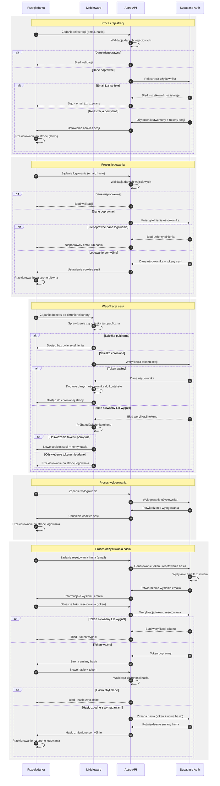

```mermaid
sequenceDiagram
    autonumber
    participant Przeglądarka
    participant Middleware
    participant API as Astro API
    participant Auth as Supabase Auth

    %% Rejestracja użytkownika
    rect rgb(240, 240, 240)
        Note over Przeglądarka,Auth: Proces rejestracji
        Przeglądarka->>API: Żądanie rejestracji (email, hasło)
        API->>API: Walidacja danych wejściowych
        alt Dane niepoprawne
            API-->>Przeglądarka: Błąd walidacji
        else Dane poprawne
            API->>Auth: Rejestracja użytkownika
            alt Email już istnieje
                Auth-->>API: Błąd - użytkownik już istnieje
                API-->>Przeglądarka: Błąd - email już używany
            else Rejestracja pomyślna
                Auth->>API: Użytkownik utworzony + tokeny sesji
                API->>Przeglądarka: Ustawienie cookies sesji
                Przeglądarka->>Przeglądarka: Przekierowanie na stronę główną
            end
        end
    end

    %% Logowanie użytkownika
    rect rgb(240, 240, 240)
        Note over Przeglądarka,Auth: Proces logowania
        Przeglądarka->>API: Żądanie logowania (email, hasło)
        API->>API: Walidacja danych wejściowych
        alt Dane niepoprawne
            API-->>Przeglądarka: Błąd walidacji
        else Dane poprawne
            API->>Auth: Uwierzytelnienie użytkownika
            alt Niepoprawne dane logowania
                Auth-->>API: Błąd uwierzytelnienia
                API-->>Przeglądarka: Niepoprawny email lub hasło
            else Logowanie pomyślne
                Auth->>API: Dane użytkownika + tokeny sesji
                API->>Przeglądarka: Ustawienie cookies sesji
                Przeglądarka->>Przeglądarka: Przekierowanie na stronę główną
            end
        end
    end

    %% Weryfikacja sesji
    rect rgb(240, 240, 240)
        Note over Przeglądarka,Auth: Weryfikacja sesji
        Przeglądarka->>Middleware: Żądanie dostępu do chronionej strony
        Middleware->>Middleware: Sprawdzenie czy ścieżka jest publiczna
        alt Ścieżka publiczna
            Middleware->>Przeglądarka: Dostęp bez uwierzytelnienia
        else Ścieżka chroniona
            Middleware->>Auth: Weryfikacja tokenu sesji
            alt Token ważny
                Auth->>Middleware: Dane użytkownika
                Middleware->>Middleware: Dodanie danych użytkownika do kontekstu
                Middleware->>Przeglądarka: Dostęp do chronionej strony
            else Token nieważny lub wygasł
                Auth-->>Middleware: Błąd weryfikacji tokenu
                Middleware->>Middleware: Próba odświeżenia tokenu
                alt Odświeżenie tokenu pomyślne
                    Middleware->>Przeglądarka: Nowe cookies sesji + kontynuacja
                else Odświeżenie tokenu nieudane
                    Middleware->>Przeglądarka: Przekierowanie na stronę logowania
                end
            end
        end
    end

    %% Wylogowanie użytkownika
    rect rgb(240, 240, 240)
        Note over Przeglądarka,Auth: Proces wylogowania
        Przeglądarka->>API: Żądanie wylogowania
        API->>Auth: Wylogowanie użytkownika
        Auth->>API: Potwierdzenie wylogowania
        API->>Przeglądarka: Usunięcie cookies sesji
        Przeglądarka->>Przeglądarka: Przekierowanie na stronę logowania
    end

    %% Odzyskiwanie hasła
    rect rgb(240, 240, 240)
        Note over Przeglądarka,Auth: Proces odzyskiwania hasła
        Przeglądarka->>API: Żądanie resetowania hasła (email)
        API->>Auth: Generowanie tokenu resetowania hasła
        Auth->>Auth: Wysyłanie emaila z linkiem
        Auth->>API: Potwierdzenie wysłania emaila
        API->>Przeglądarka: Informacja o wysłaniu emaila
        
        Przeglądarka->>API: Otwarcie linku resetowania (token)
        API->>Auth: Weryfikacja tokenu resetowania
        alt Token nieważny lub wygasł
            Auth-->>API: Błąd weryfikacji tokenu
            API-->>Przeglądarka: Błąd - token wygasł
        else Token ważny
            Auth->>API: Token poprawny
            API->>Przeglądarka: Strona zmiany hasła
            
            Przeglądarka->>API: Nowe hasło + token
            API->>API: Walidacja złożoności hasła
            alt Hasło zbyt słabe
                API-->>Przeglądarka: Błąd - hasło zbyt słabe
            else Hasło zgodne z wymaganiami
                API->>Auth: Zmiana hasła (token + nowe hasło)
                Auth->>API: Potwierdzenie zmiany hasła
                API->>Przeglądarka: Hasło zmienione pomyślnie
                Przeglądarka->>Przeglądarka: Przekierowanie na stronę logowania
            end
        end
    end
```